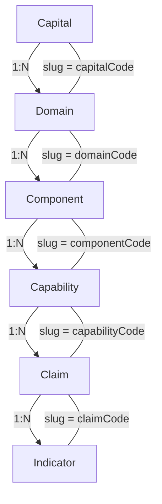
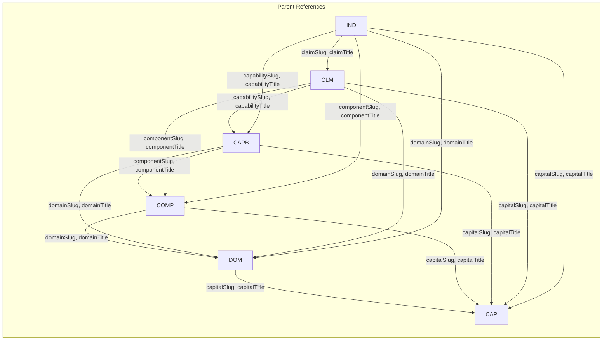

# Capital Tree JSON Model (v3)

## Hierarchy

```
capitals[] -> domains[] -> components[] -> capabilities[] -> claims[] -> indicators[]
```

## Relation Graph





---

## Object: Capital

| Param | Type | Source | Description |
|-------|------|--------|-------------|
| `slug` | string | Capital Code | Unique identifier |
| `title` | string | Name FA | Persian name |
| `titleEn` | string | Name EN | English name |
| `version` | string | Version | Version number |
| `description` | string | Definition FA | Description (or null) |
| `industries` | array | — | Always `[]` |
| `parentTitle` | string | — | Always `null` (root) |
| `source` | string | — | Always `"esos"` |
| `type` | string | — | Always `"capital"` |
| `domains` | array | — | Child domains |

---

## Object: Domain

| Param | Type | Source | Description |
|-------|------|--------|-------------|
| `slug` | string | Domain Code | Unique identifier |
| `title` | string | Name FA | Persian name |
| `titleEn` | string | Name EN | English name |
| `version` | string | Version | Version number |
| `description` | string | Definition FA | Description (or null) |
| `industries` | array | — | Always `[]` |
| `capitalSlug` | string | Capital.slug | Parent capital slug |
| `capitalTitle` | string | Capital.title | Parent capital title |
| `parentSlug` | string | Capital.slug | Parent slug (capital) |
| `parentTitle` | string | Capital.title | Parent title (capital) |
| `source` | string | — | Always `"esos"` |
| `type` | string | — | Always `"domain"` |
| `components` | array | — | Child components |

---

## Object: Component

| Param | Type | Source | Description |
|-------|------|--------|-------------|
| `slug` | string | Component Code | Unique identifier |
| `title` | string | Name FA | Persian name |
| `titleEn` | string | Name EN | English name |
| `description` | string | Definition FA | Description (or null) |
| `version` | string | Version | Version number |
| `domainSlug` | string | Domain.slug | Parent domain slug |
| `domainTitle` | string | Domain.title | Parent domain title |
| `capitalSlug` | string | Capital.slug | Grandparent capital slug |
| `capitalTitle` | string | Capital.title | Grandparent capital title |
| `parentSlug` | string | Domain.slug | Parent slug (domain) |
| `parentTitle` | string | Domain.title | Parent title (domain) |
| `source` | string | — | Always `"esos"` |
| `type` | string | — | Always `"component"` |
| `capabilities` | array | — | Child capabilities |

---

## Object: Capability

| Param | Type | Source | Description |
|-------|------|--------|-------------|
| `slug` | string | Capability Code | Unique identifier |
| `title` | string | Name FA | Persian name |
| `titleEn` | string | Name EN | English name |
| `definition` | string | Definition | Capability definition |
| `ownerRole` | string | Owner Role | Responsible role |
| `importance` | int | Criticality | Importance level |
| `version` | string | Version | Version number |
| `capitalSlug` | string | Capital.slug | Ancestor capital slug |
| `capitalTitle` | string | Capital.title | Ancestor capital title |
| `domainSlug` | string | Domain.slug | Ancestor domain slug |
| `domainTitle` | string | Domain.title | Ancestor domain title |
| `componentSlug` | string | Component.slug | Parent component slug |
| `componentTitle` | string | Component.title | Parent component title |
| `parentSlug` | string | Component.slug | Parent slug (component) |
| `parentTitle` | string | Component.title | Parent title (component) |
| `source` | string | — | Always `"esos"` |
| `type` | string | — | Always `"capability"` |
| `claims` | array | — | Child claims |
| `componentCode` | string | component_code | Original component code (from Excel) |
| `domainCode` | string | domain_code | Original domain code (from Excel) |

---

## Object: Claim

| Param | Type | Source | Description |
|-------|------|--------|-------------|
| `slug` | string | Claim Code | Unique identifier |
| `title` | string | Statement FA | Persian statement |
| `titleEn` | string | Statement EN | English statement |
| `claimType` | string | Claim Type | Type of claim |
| `evidenceRequired` | string | Evidence Required | Required evidence |
| `frequency` | string | Frequency | Reporting frequency |
| `importance` | int | Weight | Importance weight |
| `version` | string | Version | Version number |
| `capitalSlug` | string | Capital.slug | Ancestor capital slug |
| `capitalTitle` | string | Capital.title | Ancestor capital title |
| `domainSlug` | string | Domain.slug | Ancestor domain slug |
| `domainTitle` | string | Domain.title | Ancestor domain title |
| `componentSlug` | string | Component.slug | Ancestor component slug |
| `componentTitle` | string | Component.title | Ancestor component title |
| `capabilitySlug` | string | Capability.slug | Parent capability slug |
| `capabilityTitle` | string | Capability.title | Parent capability title |
| `parentSlug` | string | Capability.slug | Parent slug (capability) |
| `parentTitle` | string | Capability.title | Parent title (capability) |
| `source` | string | — | Always `"esos"` |
| `type` | string | — | Always `"claim"` |
| `indicators` | array | — | Child indicators |
| `capabilityId` | string | capability_id | Original capability ID (from Excel) |

---

## Object: Indicator

| Param | Type | Source | Description |
|-------|------|--------|-------------|
| `slug` | string | Indicator Code | Unique identifier |
| `title` | string | Name FA | Persian name |
| `titleEn` | string | Name EN | English name |
| `indicatorType` | string | Purpose | Indicator type |
| `unit` | string | Unit | Measurement unit |
| `formula` | string | Formula | Calculation formula |
| `direction` | string | Direction | Target direction (Higher/Lower) |
| `frequency` | string | Frequency | Reporting frequency |
| `dataSource` | string | Data Source | Data source |
| `minValue` | string | Baseline | Baseline value |
| `maxValue` | string | Target | Target value |
| `version` | string | Version | Version number |
| `weight` | int | Weight | Indicator weight |
| `capitalSlug` | string | Capital.slug | Ancestor capital slug |
| `capitalTitle` | string | Capital.title | Ancestor capital title |
| `domainSlug` | string | Domain.slug | Ancestor domain slug |
| `domainTitle` | string | Domain.title | Ancestor domain title |
| `componentSlug` | string | Component.slug | Ancestor component slug |
| `componentTitle` | string | Component.title | Ancestor component title |
| `capabilitySlug` | string | Capability.slug | Ancestor capability slug |
| `capabilityTitle` | string | Capability.title | Ancestor capability title |
| `claimSlug` | string | Claim.slug | Parent claim slug |
| `claimTitle` | string | Claim.title | Parent claim title |
| `parentSlug` | string | Claim.slug | Parent slug (claim) |
| `parentTitle` | string | Claim.title | Parent title (claim) |
| `source` | string | — | Always `"esos"` |
| `type` | string | — | Always `"indicator"` |
| `capabilityId` | string | capability_id | Original capability ID (from Excel) |

---

## Example JSON

```json
{
  "capitals": [
    {
      "slug": "CAP-NAT",
      "title": "سرمایه طبیعی",
      "titleEn": "Natural Capital",
      "version": "2.0",
      "description": null,
      "industries": [],
      "parentTitle": null,
      "source": "esos",
      "type": "capital",
      "domains": [
        {
          "slug": "DOM-NAT-001",
          "title": "حاکمیت محیط‌زیستی",
          "titleEn": "Environmental Governance",
          "version": "2.0",
          "description": null,
          "industries": [],
          "capitalSlug": "CAP-NAT",
          "capitalTitle": "سرمایه طبیعی",
          "parentSlug": "CAP-NAT",
          "parentTitle": "سرمایه طبیعی",
          "source": "esos",
          "type": "domain",
          "components": [
            {
              "slug": "COM-NAT-001-01",
              "title": "راهبری محیط‌زیستی",
              "titleEn": "Environmental Governance",
              "description": null,
              "version": "2.0",
              "domainSlug": "DOM-NAT-001",
              "domainTitle": "حاکمیت محیط‌زیستی",
              "capitalSlug": "CAP-NAT",
              "capitalTitle": "سرمایه طبیعی",
              "parentSlug": "DOM-NAT-001",
              "parentTitle": "حاکمیت محیط‌زیستی",
              "source": "esos",
              "type": "component",
              "capabilities": [
                {
                  "slug": "CAPB-001",
                  "title": "تعیین نظارت هیئت‌مدیره",
                  "titleEn": "Board Oversight",
                  "definition": "توانایی نظارت بر موضوعات محیط‌زیستی",
                  "ownerRole": "مدیر پایداری",
                  "importance": 5,
                  "version": "2.0",
                  "capitalSlug": "CAP-NAT",
                  "capitalTitle": "سرمایه طبیعی",
                  "domainSlug": "DOM-NAT-001",
                  "domainTitle": "حاکمیت محیط‌زیستی",
                  "componentSlug": "COM-NAT-001-01",
                  "componentTitle": "راهبری محیط‌زیستی",
                  "parentSlug": "COM-NAT-001-01",
                  "parentTitle": "راهبری محیط‌زیستی",
                  "source": "esos",
                  "type": "capability",
                  "claims": [
                    {
                      "slug": "CLM-001",
                      "title": "سیاست نظارت تصویب شده",
                      "titleEn": "Oversight Policy Approved",
                      "claimType": "Governance & Policy",
                      "evidenceRequired": "سیاست، مصوبات",
                      "frequency": "سالانه",
                      "importance": 5,
                      "version": "2.0",
                      "capitalSlug": "CAP-NAT",
                      "capitalTitle": "سرمایه طبیعی",
                      "domainSlug": "DOM-NAT-001",
                      "domainTitle": "حاکمیت محیط‌زیستی",
                      "componentSlug": "COM-NAT-001-01",
                      "componentTitle": "راهبری محیط‌زیستی",
                      "capabilitySlug": "CAPB-001",
                      "capabilityTitle": "تعیین نظارت هیئت‌مدیره",
                      "parentSlug": "CAPB-001",
                      "parentTitle": "تعیین نظارت هیئت‌مدیره",
                      "source": "esos",
                      "type": "claim",
                      "indicators": [
                        {
                          "slug": "IND-001",
                          "title": "درصد موضوعات با نظارت رسمی",
                          "titleEn": "Oversight Coverage %",
                          "indicatorType": "Governance KPI",
                          "unit": "درصد",
                          "formula": "موضوعات تحت نظارت/کل موضوعات*100",
                          "direction": "Higher",
                          "frequency": "سالانه",
                          "dataSource": "ERP/EMS/HSE",
                          "minValue": "",
                          "maxValue": "",
                          "version": "2.0",
                          "weight": 1,
                          "capitalSlug": "CAP-NAT",
                          "capitalTitle": "سرمایه طبیعی",
                          "domainSlug": "DOM-NAT-001",
                          "domainTitle": "حاکمیت محیط‌زیستی",
                          "componentSlug": "COM-NAT-001-01",
                          "componentTitle": "راهبری محیط‌زیستی",
                          "capabilitySlug": "CAPB-001",
                          "capabilityTitle": "تعیین نظارت هیئت‌مدیره",
                          "claimSlug": "CLM-001",
                          "claimTitle": "سیاست نظارت تصویب شده",
                          "parentSlug": "CLM-001",
                          "parentTitle": "سیاست نظارت تصویب شده",
                          "source": "esos",
                          "type": "indicator"
                        }
                      ]
                    }
                  ]
                }
              ]
            }
          ]
        }
      ]
    }
  ]
}
```

---

## Slug Naming Convention

| Object | Slug Pattern | Example |
|--------|-------------|---------|
| Capital | `{Capital Code}` | `CAP-NAT` |
| Domain | `{Domain Code}` | `DOM-NAT-001` |
| Component | `{Component Code}` | `COM-NAT-001-01` |
| Capability | `{Capability Code}` | `CAPB-001` |
| Claim | `{Claim Code}` | `CLM-001` |
| Indicator | `{Indicator Code}` | `IND-001` |
